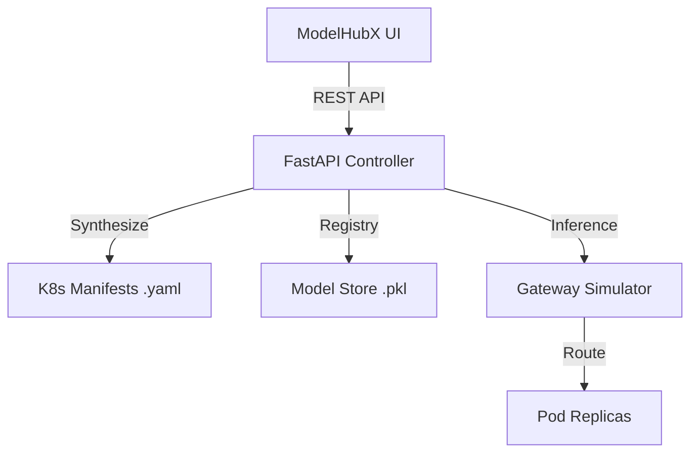

# ModelHubX: Industrial MLOps & Deployment Platform 🚀

**ModelHubX** is a high-end MLOps platform designed for distributed model registry, automated Kubernetes manifest generation, and real-time inference monitoring. It features a premium, glassmorphic "Mission Control" dashboard and a robust FastAPI backend synthesizer.

## 💎 Key Features

- **Model Registry v2**: Version-controlled model uploads with automated tracking.
- **K8s Manifest Synthesizer**: Generates production-ready Kubernetes Deployment and Service YAMLs with HPA (Horizontal Pod Autoscaling) support.
- **Inference Gateway**: Simulated ClusterIP gateway for testing model predictions with real-time feedback.
- **Premium UI/UX**: Dual-theme (Dark/Light) obsidian aesthetic with high-density MLOps metrics.
- **Infrastructure-as-Code**: Automated generation of scaling and resource limit policies.

## 🛠️ Technology Stack

- **Backend**: Python 3.9, FastAPI, Pydantic, Uvicorn.
- **Frontend**: Vanilla JS (ES6+), High-End CSS3 (Glassmorphism, CSS Variables).
- **Infrastructure**: Kubernetes (Synthesis), Docker, Docker Compose.
- **Data Store**: Persistent Volume Storage, Redis (Metadata Store).

## 🏗️ Architecture Overview



## 🚀 Quick Start

### Prerequisites
- Docker & Docker Compose
- Python 3.9+ (for local testing)

### Run via Docker
```bash
git clone https://github.com/YOUR_USER/kubeai-project.git
cd kubeai-project
docker-compose up --build
```
Access the Mission Control dashboard at `http://localhost:8000`.

## 🌗 Dual-Theme Experience
ModelHubX supports both **Obsidian Dark** and **Clean SaaS Light** modes, optimized for high-density data visibility across different lighting conditions.

---
*Developed as a signature MLOps Portfolio Project.*
